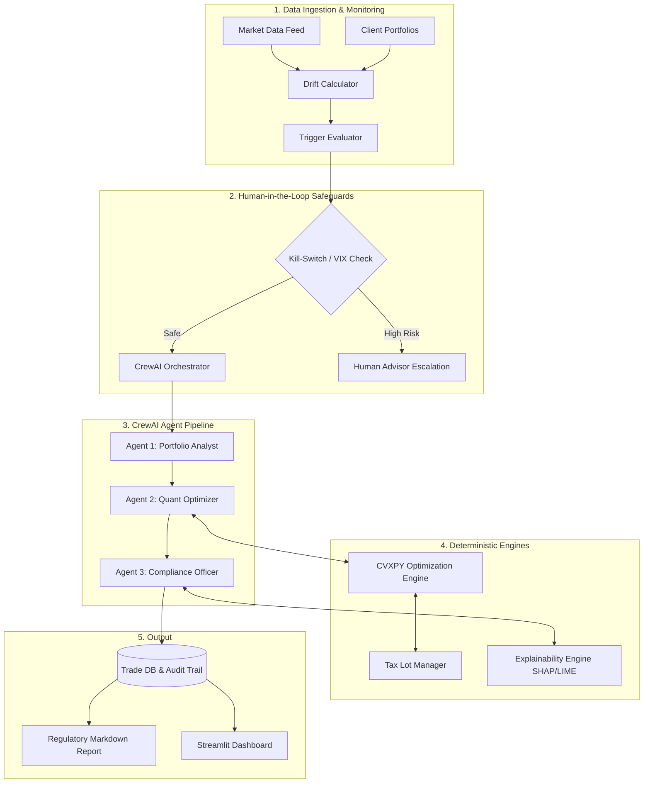
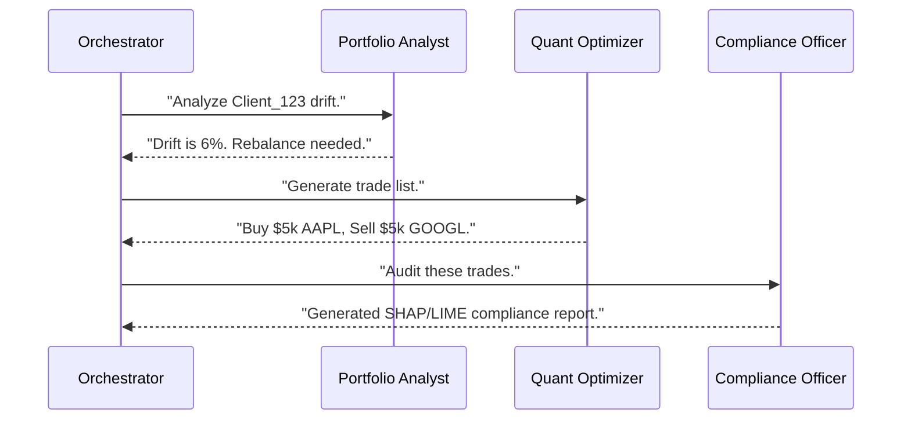

# Autonomous Portfolio Rebalancing Agent 🤖📈

Welcome to the **Autonomous Portfolio Rebalancing Agent**—a comprehensive, enterprise-grade educational module and reference implementation for applying Agentic AI to quantitative finance. 

This repository isn't just a codebase; it's a **Learning Module** designed to teach you how to bridge the gap between deterministic mathematical optimization (Convex Optimization) and non-deterministic Large Language Models (CrewAI Orchestration) while maintaining strict regulatory compliance (SHAP/LIME Explainability).

---

## 📚 Learning Objectives

By exploring this repository, you will learn how to:
1. **Detect Portfolio Drift**: Mathematically quantify when a portfolio deviates from its target risk profile.
2. **Execute Convex Optimization**: Use `cvxpy` to generate trade lists that minimize transaction costs while adhering to strict turnover and liquidity constraints.
3. **Orchestrate AI Agents**: Use `CrewAI` to simulate a "Quant Team" (Analyst, Optimizer, Compliance Officer) that sequentially processes a portfolio.
4. **Implement AI Safeguards**: Build deterministic Kill-Switches (e.g., VIX spikes) that halt autonomous trading and escalate to human advisors.
5. **Generate Regulatory Explanations**: Use SHAP and LIME to crack open the AI "black box" and generate SEBI/SEC compliant audit reports for every single trade.

---

## 🏗️ System Architecture Flowchart



---

## 📖 Module 1: The Drift Engine (When to trade?)

Portfolios naturally drift as asset prices change. The **Drift Calculator** uses vectorized Pandas operations to calculate the *Root Mean Square Drift (RMSD)* and *Sum of Absolute Drift (SAD)*.

Instead of rebalancing on a static calendar (e.g., every quarter), this engine triggers rebalances *only* when drift exceeds a client's specific `drift_band` (e.g., 5%).

**Key Concept: The Trigger Evaluator**
Before an AI agent even wakes up, the system evaluates triggers deterministically:
- `ThresholdTrigger`: Fires when drift > 5%.
- `EventTrigger`: Fires on market crashes or tax harvesting seasons.

---

## 📖 Module 2: Convex Optimization (How to trade?)

When the AI decides a rebalance is needed, it delegates the math to a deterministic **CVXPY** quadratic programming solver. LLMs are terrible at math, so we use them purely for *orchestration*, while standard Python libraries handle the heavy lifting.

### The Mathematics of Rebalancing
The goal is to minimize Tracking Error (the distance from the target portfolio) subject to constraints:

```python
# Objective: minimize (w - w_target)^T * Cov * (w - w_target)
tracking_error = cp.quad_form(w - target_weights, covariance_matrix)
objective = cp.Minimize(tracking_error)

# Constraints
constraints = [
    cp.sum(w) == 1.0,  # Fully invested
    w >= 0,            # Long only
    0.5 * cp.norm(w - current_weights, 1) <= max_turnover # Turnover Limit
]
```

**Advanced Constraints:**
- **Tax Harvesting**: The `TaxHarvestingScanner` uses HIFO (Highest In, First Out) accounting to sell lots with the highest cost basis, banking capital losses to offset future taxes, while strictly avoiding Wash Sales (buying the same asset within 30 days).
- **Liquidity Scoring**: The `LiquidityScorer` ensures we never exceed 5% of an asset's Average Daily Volume (ADV). If a trade is too large, it automatically slices it into a VWAP/TWAP execution schedule spanning multiple days.

---

## 📖 Module 3: Multi-Agent Orchestration

This project utilizes **CrewAI** to manage the workflow. Think of CrewAI as the manager of a highly specialized team.



By separating roles, the LLM is less likely to hallucinate. The Analyst focuses purely on assessment, the Optimizer calls the CVXPY tool, and the Compliance Officer writes the final report.

---

## 📖 Module 4: Regulatory Explainability (SHAP & LIME)

In finance, you cannot simply say "The AI did it." You must prove *why* the AI did it. 

We trained a surrogate **XGBoost Classifier** on synthetic rebalancing decisions to mimic the system's behavior. We then crack open this model using:

1. **SHAP (Shapley Additive exPlanations)**: Calculates the *global* feature importance. 
   > *"Drift Magnitude was responsible for 80% of this rebalancing decision."*
2. **LIME (Local Interpretable Model-agnostic Explanations)**: Generates local *counterfactuals*. 
   > *"If the VIX (volatility index) had been 10 points lower, this trade would not have executed."*

These outputs are formatted by the LLM into human-readable Markdown templates that are ready for Chief Compliance Officer (CCO) sign-off.

---

## 🚀 Quick Start Guide

Ready to see it in action?

### 1. Installation
Ensure you have Python 3.12+ installed.
```bash
git clone https://github.com/Paragiscool/Portfolio_Rebalancing_Agent.git
cd Portfolio_Rebalancing_Agent

pip install -r requirements.txt
```

### 2. Environment Setup
Copy the environment template and add your OpenAI API key (required for CrewAI):
```bash
cp .env.example .env
# Edit .env to add OPENAI_API_KEY="sk-..."
```

### 3. Run the Dashboard
The best way to experience the system is through the 5-view interactive Streamlit dashboard:
```bash
streamlit run src/dashboard/app.py
```
*Navigate through the Portfolio Overview, Rebalancing Activity, Performance Analytics, Explainability Centre, and System Health.*

### 4. Run the Integration Tests
See the system handle 5 extreme market scenarios (Crash, Sector Rotation, Tax Harvesting):
```bash
python -m src.simulation.scenario_runner
```

---

## 🧪 Testing and Coverage

This repository maintains enterprise-grade reliability. To run the full test suite:
```bash
pytest --cov=src tests/ -v
```
*Coverage is enforced at >70%, with core math engines operating at 100% coverage.*

---

## 🏗️ Deployment Recommendations

While this repository is a local prototype, deploying to production requires:
1. **Compute**: AWS Fargate (Serverless Docker containers) for the CrewAI orchestrator.
2. **Database**: Amazon RDS (PostgreSQL) for storing historical Tax Lots.
3. **Execution**: Integration with Alpaca or Interactive Brokers API for real trade execution.
4. **Secrets**: AWS Secrets Manager for all broker keys.

For detailed deployment architecture, refer to `deployment_recommendations.md`.

---
*Disclaimer: This is an educational codebase demonstrating Agentic AI design patterns. It is not financial advice, and should not be connected to a live brokerage account without extensive independent auditing.*
