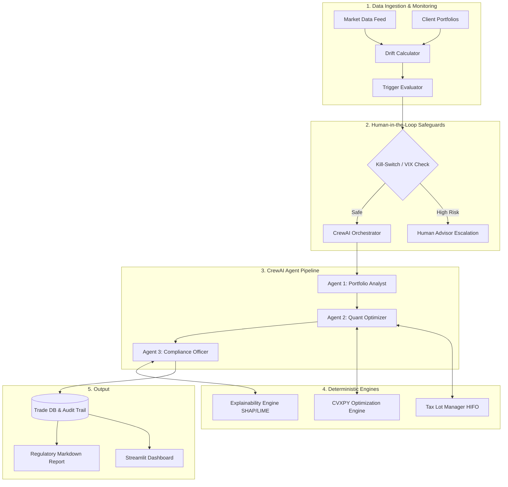

# Autonomous Portfolio Rebalancing Agent 🤖📈

**An Enterprise-Grade Reference Architecture for Agentic AI in Quantitative Finance**

Welcome to the definitive guide and codebase for the Autonomous Portfolio Rebalancing Agent. This document is designed not just as a quick-start guide, but as a **deep-dive learning module and memory-recall artifact**. If you are returning to this codebase 6 months from now, this document will remind you exactly *how* you built it, *why* you made specific architectural choices, where the core math lives, and how to extend it.

---

## 🏛️ 1. High-Level System Architecture

At its core, this system bridges **deterministic mathematical engines** (which provide guaranteeable accuracy) with **non-deterministic LLM agents** (which provide reasoning, orchestration, and natural language explainability).



---

## 🗺️ 2. Repository Code Map

If you need to revise or fix a specific part of the system, here is exactly where you look:

```text
Portfolio_Rebalancing_Agent/
│
├── src/
│   ├── engine/                # 📉 Drift & Triggers (When to trade?)
│   │   ├── drift_calculator.py    # Math: RMSD and SAD calculations (Pandas)
│   │   └── triggers.py            # Logic: Threshold, Event, Calendar triggers
│   │
│   ├── optimiser/             # 🧮 Convex Math (How to trade?)
│   │   ├── portfolio_optimiser.py # Math: CVXPY quadratic programming 
│   │   ├── tax_lot_manager.py     # Logic: HIFO accounting & lot tracking
│   │   └── tax_optimiser.py       # Logic: Wash-sale blocking
│   │
│   ├── orchestration/         # 🧠 LLM Brain (CrewAI)
│   │   ├── crew_definition.py     # Defines the 3 Agents and their prompts
│   │   └── agent_tools.py         # Wraps the Python math into @tools for the LLM
│   │
│   ├── explainability/        # ⚖️ Compliance & SEC/SEBI Reports
│   │   ├── surrogate_model.py     # ML: XGBoost classifier trained on decisions
│   │   ├── shap_lime_explainer.py # Math: SHAP (global) and LIME (local) generation
│   │   └── generators.py          # LLM: Formats math into human-readable Markdown
│   │
│   ├── human_in_loop/         # 🛑 Safety & Kill-Switches
│   │   └── intervention_classifier.py # Logic: VIX checks and Turnover limits
│   │
│   ├── dashboard/             # 📊 UI (Streamlit)
│   │   └── app.py                 # Frontend code for the 5-view dashboard
│   │
│   └── backtesting/           # ⏱️ Performance validation
│       └── strategy_comparator.py # Compares AI Agent vs Buy-and-Hold
```

---

## 🔬 3. Deep Dive: The Engines

### A. The Drift Engine (Pandas Vectorization)
**File to check:** `src/engine/drift_calculator.py`

You built the drift calculator using `pandas` vectorized operations for extreme speed (capable of scanning 50,000 portfolios in seconds). It calculates two specific metrics:
1. **Root Mean Square Drift (RMSD):** Penalizes large deviations in a single asset class more heavily than small deviations across many.
2. **Sum of Absolute Drift (SAD):** The absolute total distance from the target portfolio.

*How to revise:* If you want to add a new asset class (e.g., "Crypto"), you simply add it to the `self.asset_classes` list in the `__init__` of `DriftCalculator`.

### B. The Convex Optimizer (CVXPY)
**File to check:** `src/optimiser/portfolio_optimiser.py`

This is the mathematical heart of the project. LLMs cannot do math reliably, so the "Quant Optimizer Agent" simply passes arrays to this CVXPY engine.
- **Objective:** Minimize tracking error `(w - w_target)^T * Cov * (w - w_target)`.
- **Constraint 1:** Weights must sum to 1.0 (Fully Invested).
- **Constraint 2:** Weights must be >= 0 (Long Only, no shorting).
- **Constraint 3:** `0.5 * cp.norm(w - current_weights, 1) <= max_turnover`. This strictly prevents the AI from generating excessive churn.

*How to revise:* To add ESG constraints (e.g., "Max 5% in fossil fuels"), you would add a new constraint array directly into the `constraints.append()` block in `portfolio_optimiser.py`.

### C. Multi-Agent Orchestration (CrewAI)
**File to check:** `src/orchestration/crew_definition.py`

Why did you use 3 distinct agents instead of 1 massive prompt? **Hallucination reduction.**
- **Analyst:** Given a strict prompt to *only* evaluate if drift > threshold.
- **Optimizer:** Given a strict prompt to *only* generate trades by calling the CVXPY tool.
- **Compliance:** Given a strict prompt to *only* write a report based on the output.
Because they operate sequentially, if the Optimizer hallucinates a bad trade, the CVXPY tool simply crashes and returns an error to the LLM, forcing it to try again, rather than executing a bad trade.

*How to revise:* To swap `gpt-4o-mini` for `Claude 3.5 Sonnet` or a local `Llama3` instance, you simply change the `llm_model` string initialized in `RebalancingCrew`.

### D. Regulatory Explainability (SHAP & LIME)
**File to check:** `src/explainability/shap_lime_explainer.py`

Black-box AI is illegal in institutional finance. You solved this by training a fast, lightweight **XGBoost Surrogate Model** (`surrogate_model.py`) that mimics the complex CrewAI decision logic. Once trained, you applied:
- **SHAP (Global):** Calculates the exact mathematical contribution of every feature. (e.g., *"Drift Magnitude was responsible for +0.15 of the decision to trade."*)
- **LIME (Local):** Generates counterfactuals. (e.g., *"If VIX had been < 20, we would not have traded."*)

*How to revise:* If you add a new metric (e.g., "Interest Rates") to the AI's decision-making, you MUST add "interest_rates" to the `self.feature_names` array in `surrogate_model.py` so SHAP knows to track it.

### E. Safety Kill-Switches
**File to check:** `src/human_in_loop/intervention_classifier.py`

Before any trade is finalized, it must pass the `InterventionClassifier`. 
If `VIX > 40` (Market Crash), the system returns `True` for the Kill-Switch, immediately halting autonomous trading and saving a markdown file to `reports/escalations/` for human advisor review.

---

## 🛠️ 4. Quick Start & Execution

### Installation
```bash
git clone https://github.com/Paragiscool/Portfolio_Rebalancing_Agent.git
cd Portfolio_Rebalancing_Agent
python -m pip install -r requirements.txt
```

### Environment Config
```bash
cp .env.example .env
# Open .env and add your OPENAI_API_KEY
```

### Running the System
**1. The Interactive Dashboard (Best for Demos)**
```bash
streamlit run src/dashboard/app.py
```

**2. The Integration Simulator (Testing Market Crashes)**
```bash
python -m src.simulation.scenario_runner
```

**3. The Strategy Backtester**
```bash
python -m src.backtesting.strategy_comparator
```

---

## 🚢 5. Future Production Deployment

If you ever need to take this prototype and deploy it for a real hedge fund or wealth manager, follow this architecture:
1. **Containerize:** Dockerize the `CrewAI` backend and deploy it to **AWS Fargate** (Serverless). This allows you to scale to 10,000 parallel agents instantly during a market crash, then scale to 0 when idle.
2. **Database:** Swap the mocked Python dictionaries for **AWS RDS (PostgreSQL)**. 
3. **Broker API:** Connect the output of the CVXPY optimizer directly to **Interactive Brokers** or **Alpaca API**.
4. **Secrets:** Never store `.env` files in production; use **AWS Secrets Manager**.

*(For more details, see `deployment_recommendations.md`)*

---
*Developed by Parag.*
